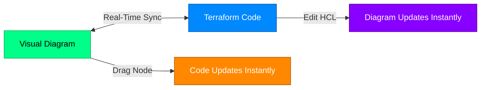
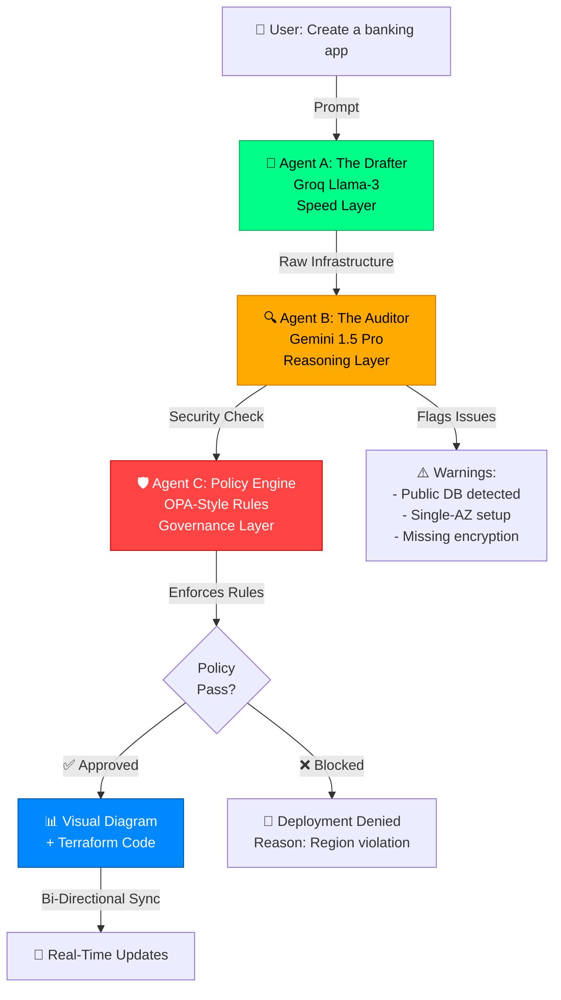

---
title: Nebula Backend
emoji: 🚀
colorFrom: blue
colorTo: purple
sdk: docker
app_port: 7860
pinned: false
---

<div align="center">

#  Nebula Cloud

### *The Intelligent Infrastructure Guardian*

**From Code Generation to Infrastructure Governance**


<div align="center">

---

## 🌟 **[→ TRY NEBULA CLOUD LIVE ←](https://nebula-cloud-seven.vercel.app/)** 🌟

*Experience the future of infrastructure governance in your browser*

---

</div>


</div>

---

## 🎯 What is Nebula Cloud?

**Nebula Cloud** isn't just another infrastructure-as-code generator. It's an **AI-powered guardian** that stands between you and production disasters.

> *"AI can write code in seconds. But can it make that code secure, compliant, and production-ready?"*

We solve the **Feasibility Gap** — where AI-generated infrastructure looks perfect but hides security vulnerabilities, compliance violations, and cost bombs.

### 💥 The Problem

<table>
<tr>
<td width="50%">

**🔴 Traditional Approach**
```
Developer → AI → Infrastructure
```
❌ Open security groups (0.0.0.0/0)
❌ Public databases
❌ Single-zone deployments
❌ No cost controls
❌ Compliance blind spots

</td>
<td width="50%">

**✅ Nebula Cloud Way**
```
Developer → Multi-Agent Review → Safe Infrastructure
```
✅ Automated security audits
✅ Compliance enforcement
✅ Multi-AZ by default
✅ Cost optimization
✅ Visual + Code sync

</td>
</tr>
</table>

---

## ⚡ The Game Changer: Bi-Directional Sync

**The industry's first truly synchronized visual-to-code infrastructure editor.**



**What This Means:**
- 🎨 **Drag an EC2 from Public to Private Subnet** → Terraform `subnet_id` updates automatically
- 💻 **Change `t2.micro` to `t3.large` in code** → Visual node updates instantly
- 🔄 **No more drift** between what you see and what you deploy

---

## 🏗️ Architecture: The Multi-Agent System

Nebula Cloud uses a **three-agent review chain** that mimics how senior engineers actually work:



### The Three Guardians

| Agent | Model | Role | Checks |
|-------|-------|------|--------|
| 🚀 **The Drafter** | Groq Llama-3 | Instant code generation | Translates "banking app" → JSON + Terraform |
| 🔍 **The Auditor** | Gemini 1.5 Pro | Security & compliance review | Multi-AZ? Encryption? Private resources? |
| 🛡️ **The Policy Engine** | OPA Rules | Hard enforcement | Blocks shadow IT, enforces regions |

---

## ✨ Features That Make You Invincible

<details open>
<summary><b>🔄 Real-Time Bi-Directional Sync (Industry First)</b></summary>

- Drag nodes on canvas → Terraform rewrites instantly
- Edit `.tf` files → Visual diagram updates in real-time
- **Never** experience diagram-code drift again

</details>

<details>
<summary><b>🤖 Natural Language to Infrastructure</b></summary>

**Input:**
```
"Create a web server with RDS database in a private subnet"
```

**Output:**
- ✅ Full architecture diagram
- ✅ Production-ready Terraform code
- ✅ Security groups configured
- ✅ Multi-AZ enabled by default

</details>

<details>
<summary><b>🔍 Automated Security Auditing</b></summary>

**Real-Time Detection:**
- 🔴 **Critical:** Public databases, 0.0.0.0/0 security groups
- 🟡 **Warning:** Single-AZ deployments, missing encryption
- 🟢 **Approved:** Meets all security standards

</details>

<details>
<summary><b>🛠️ One-Click Auto-Remediation</b></summary>

Found a vulnerability? Click **"Fix Now"** and watch Nebula:
1. Rewrite the Terraform code
2. Update the visual diagram
3. Apply security best practices
4. Mark the issue as ✅ Resolved

</details>

<details>
<summary><b>📜 Policy Enforcement</b></summary>

```python
# Example Policy Rule
IF deployment.region NOT IN ['us-east-1', 'eu-west-1']:
    BLOCK deployment
    REASON: "Data residency violation"
```

Prevents shadow IT and ensures compliance **before** deployment.

</details>

<details>
<summary><b>🎨 Interactive Visual Canvas</b></summary>

- Powered by **React Flow**
- Smart hierarchical layouts (VPC → Subnet → Instance)
- Cyberpunk-themed UI with dark mode
- Drag, zoom, and reorganize with ease

</details>

---


## 🛠️ Tech Stack

<div align="center">

### Frontend


### Backend


### AI & Infrastructure


### Database


</div>
